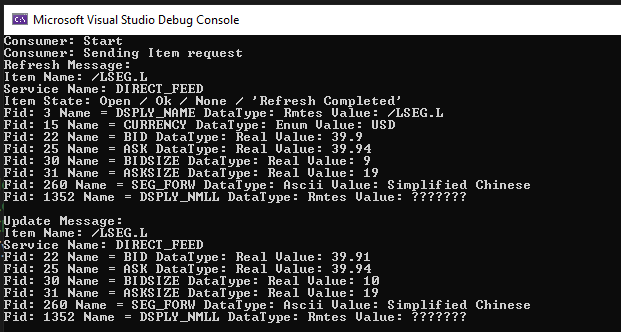
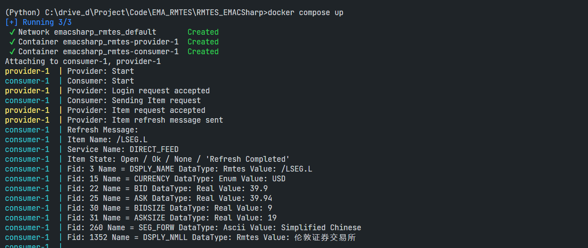
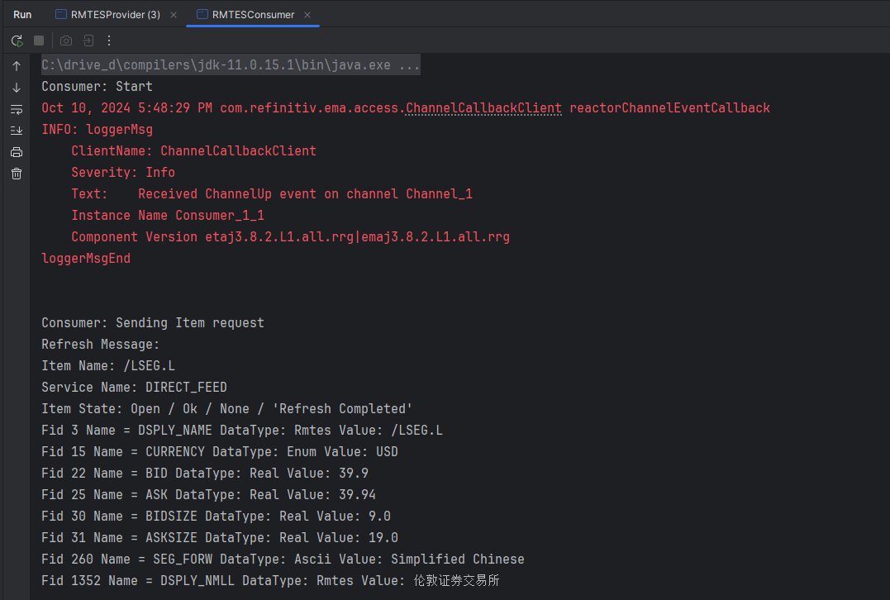

# Encoding and Decoding non-ASCII text using EMA C# and Java

- version: 1.0.0
- Last Update: Oct 2024
- Environment:  or Windows
- Compiler: .NET 8.0 and Java SDK 11
- Prerequisite: [prerequisite](#prerequisite)

Example Code Disclaimer:
ALL EXAMPLE CODE IS PROVIDED ON AN “AS IS” AND “AS AVAILABLE” BASIS FOR ILLUSTRATIVE PURPOSES ONLY. REFINITIV MAKES NO REPRESENTATIONS OR WARRANTIES OF ANY KIND, EXPRESS OR IMPLIED, AS TO THE OPERATION OF THE EXAMPLE CODE, OR THE INFORMATION, CONTENT, OR MATERIALS USED IN CONNECTION WITH THE EXAMPLE CODE. YOU EXPRESSLY AGREE THAT YOUR USE OF THE EXAMPLE CODE IS AT YOUR SOLE RISK.

## <a id="overview"></a>Overview

This article is a sequel to my colleague's [Encoding and Decoding non-ASCII text using EMA and RFA C++/.NET](https://developers.lseg.com/en/article-catalog/article/encoding-and-decoding-non-ascii-text-using-ema-and-rfa-cnet). While that article describes how to encoding and decoding RMTES String data with the [EMA C++](https://developers.lseg.com/en/api-catalog/refinitiv-real-time-opnsrc/rt-sdk-cc) and the legacy RFA C++ APIs, the part two article shows the same process with the strategic [EMA C#](https://developers.lseg.com/en/api-catalog/refinitiv-real-time-opnsrc/refinitiv-real-time-csharp-sdk) and [EMA Java](https://developers.lseg.com/en/api-catalog/refinitiv-real-time-opnsrc/rt-sdk-java) APIs.

I am demonstrating with RTSDK Java 2.2.2.L1 (EMA Java 3.8.2.0) and RTSDK C# 2.2.2.L1 (EMA C# 3.3.3.0). 

## <a id="rmtes_recap"></a>RMTES Recap: What is RMTES?

There are some fields on the data dictionary (*RDMFieldDictionary*) that use the **RMTES_String** data type. This data type is designed to use with local language (non-ASCII text) such as Chinese, Korean, Thai, etc. 

Example RMTES_String field:

```ini
DSPLY_NMLL "LCL LANG DSP NM"     1352  NULL        ALPHANUMERIC       32  RMTES_STRING    32
```

### RMTES Encoding

RMTES uses [ISO 2022](https://www.iso20022.org/) escape sequences to select the character sets used. RMTES provides support for Reuters Basic Character Set (RBCS), UTF-8, Japanese Latin and Katakana (JIS C 6220 - 1969), Japanese Kanji (JIS X 0208 - 1990), and Chinese National Standard (CNS 11643-1986). RMTES also supports sequences for character repetition and sequences for partial updates. 

Although there is no open RMTES encoder library provide for external developers, they can use the switching function provided for encoding RMTES string and switching from default ISO 2022 scheme to UTF-8 character set. That mean developers can use the UTF-8 character set to publish data for RMTES field type and then publish that string to the Real-Time system.

The switching function uses the first three bytes of the text as the escape sequence. The Real-Time Distribution System components use them for the text encoded with UTF-8. Those three bytes are **1B 25 30** as follows:

```txt
0x1B 0x25 0x30
```

An application can prepend 0x1B, 0x25, 0x30 to the UTF8 string and encode that way as an RMTES type. The escape sequence characters indicate to the RMTES parser or decoder that it’s supposed to be a UTF-8 string.

## <a id="prerequisite"></a>Prerequisite

Before I am going further, there is some prerequisite, dependencies, and libraries that the project is needed.

### Docker Desktop Application

You can build and run each EMA C#/Java Provider and Consumer applications manually. However, it is easier to build and run with a simple ```docker compose``` command. 

The [Docker Desktop](https://www.docker.com/products/docker-desktop/) application is required to run all projects.

### Internet Access

The EMA C# library available on the [NuGet](https://www.nuget.org/) repository. While the EMA Java library is also available on the [Maven Central](https://central.sonatype.com/) repository.

This project download the EMA libraries over internet to build and run applications.

### EMA C# Projects Prerequisite

#### .NET SDK

Firstly, you need [.NET 8 SDK](https://dotnet.microsoft.com/en-us/download/dotnet/8.0).

Please check [How to check that .NET is already installed](https://learn.microsoft.com/en-us/dotnet/core/install/how-to-detect-installed-versions) to verify installed .NET versions on your machine.

#### Visual Studio Code or Visual Studio IDE

The EMA C# projects support both [VS Code](https://code.visualstudio.com/) editor and [Visual Studio 2022](https://visualstudio.microsoft.com/) IDE.

### EMA Java Project Prerequisite

#### Java SDK

For the Java project, you need Java SDK version 11, 17, or 21 (either Oracle JDK or OpenJDK). 

#### Apache

The Java project uses [Apache Maven](https://maven.apache.org/) as a project build automation tool. 

#### IntelliJ IDEA

The EMA Java project supports [IntelliJ IDEA](https://www.jetbrains.com/idea/) IDE. However, any IDEs or Editors that support [Maven Standard Directory Layout](https://maven.apache.org/guides/introduction/introduction-to-the-standard-directory-layout.html) should be fine.

That covers the prerequisite of this RMTES project.

## <a id="developoment"></a>Development Detail

Please check the [Article.md](./Article.md) file for more detail about how to encode and decode the RMTES string data with the EMA C# and Java APIS.

## <a id="run"></a>How to run

To build and run the Provider and Consumer projects with Docker, please go to the *RMTES_EMACSharp* or *RMTES_EMAJava* folder via a command prompt application and run the following [Docker Compose](https://docs.docker.com/compose/) command.

```bash
docker compose up
```
To stop the projects, use the following Docker Compose command inside the same folder on a command prompt.

```bash
docker compose down
```

Example Results (from EMA C# projects):

```bash
$>docker compose up
[+] Running 3/3
 ✔ Network emacsharp_rmtes_default       Created                                                                                                   0.1s 
 ✔ Container emacsharp_rmtes-provider-1  Created                                                                                                   0.1s 
 ✔ Container emacsharp_rmtes-consumer-1  Created                                                                                                   0.1s 
Attaching to consumer-1, provider-1
provider-1  | Provider: Start
consumer-1  | Consumer: Start
provider-1  | Provider: Login request accepted
consumer-1  | Consumer: Sending Item request
provider-1  | Provider: Item request accepted
provider-1  | Provider: Item refresh message sent
consumer-1  | Refresh Message:
consumer-1  | Item Name: /LSEG.L
consumer-1  | Service Name: DIRECT_FEED
consumer-1  | Item State: Open / Ok / None / 'Refresh Completed'
consumer-1  | Fid: 3 Name = DSPLY_NAME DataType: Rmtes Value: /LSEG.L
consumer-1  | Fid: 15 Name = CURRENCY DataType: Enum Value: USD
consumer-1  | Fid: 22 Name = BID DataType: Real Value: 39.9
consumer-1  | Fid: 25 Name = ASK DataType: Real Value: 39.94
consumer-1  | Fid: 30 Name = BIDSIZE DataType: Real Value: 9
consumer-1  | Fid: 31 Name = ASKSIZE DataType: Real Value: 19
consumer-1  | Fid: 260 Name = SEG_FORW DataType: Ascii Value: Simplified Chinese
consumer-1  | Fid: 1352 Name = DSPLY_NMLL DataType: Rmtes Value: 伦敦证券交易所
consumer-1  | 
provider-1  | Provider: Sending Item update messages
consumer-1  | Update Message:
consumer-1  | Item Name: /LSEG.L
consumer-1  | Service Name: DIRECT_FEED
consumer-1  | Fid: 22 Name = BID DataType: Real Value: 39.91
consumer-1  | Fid: 25 Name = ASK DataType: Real Value: 39.94
consumer-1  | Fid: 30 Name = BIDSIZE DataType: Real Value: 10
consumer-1  | Fid: 31 Name = ASKSIZE DataType: Real Value: 19
consumer-1  | Fid: 260 Name = SEG_FORW DataType: Ascii Value: Japanese
consumer-1  | Fid: 1352 Name = DSPLY_NMLL DataType: Rmtes Value: ロンドン証券取引所
consumer-1  | 
consumer-1  | Update Message:
consumer-1  | Item Name: /LSEG.L
consumer-1  | Service Name: DIRECT_FEED
consumer-1  | Fid: 22 Name = BID DataType: Real Value: 39.92
consumer-1  | Fid: 25 Name = ASK DataType: Real Value: 39.95
consumer-1  | Fid: 30 Name = BIDSIZE DataType: Real Value: 11
consumer-1  | Fid: 31 Name = ASKSIZE DataType: Real Value: 20
consumer-1  | Fid: 260 Name = SEG_FORW DataType: Ascii Value: Traditional Chinese
consumer-1  | Fid: 1352 Name = DSPLY_NMLL DataType: Rmtes Value: 倫敦證券交易所
consumer-1  | 
consumer-1  | Update Message:
consumer-1  | Item Name: /LSEG.L
consumer-1  | Service Name: DIRECT_FEED
consumer-1  | Fid: 22 Name = BID DataType: Real Value: 39.93
consumer-1  | Fid: 25 Name = ASK DataType: Real Value: 39.96
consumer-1  | Fid: 30 Name = BIDSIZE DataType: Real Value: 12
consumer-1  | Fid: 31 Name = ASKSIZE DataType: Real Value: 21
consumer-1  | Fid: 260 Name = SEG_FORW DataType: Ascii Value: Thai
consumer-1  | Fid: 1352 Name = DSPLY_NMLL DataType: Rmtes Value: ตลาดหลักทรัพย์ลอนดอน
consumer-1  | 
consumer-1  | Update Message:
consumer-1  | Item Name: /LSEG.L
consumer-1  | Service Name: DIRECT_FEED
consumer-1  | Fid: 22 Name = BID DataType: Real Value: 39.94
consumer-1  | Fid: 25 Name = ASK DataType: Real Value: 39.97
consumer-1  | Fid: 30 Name = BIDSIZE DataType: Real Value: 13
consumer-1  | Fid: 31 Name = ASKSIZE DataType: Real Value: 22
consumer-1  | Fid: 260 Name = SEG_FORW DataType: Ascii Value: Korean
consumer-1  | Fid: 1352 Name = DSPLY_NMLL DataType: Rmtes Value: 런던 증권 거래소
consumer-1  | 
...
```

## <a id="troubleshooting"></a>Troubleshooting

**Question 1**: I tried the EMA C# example projects on Windows using Visual Studio 2022 IDE. The Consumer application shows RMTES data as "???" string.



**Answer**: This is the Windows built-in command prompt (and Powershell) applications issue that cannot display the UTF-8 text correctly by default. I strongly suggest you run examples on the Linux environment or Docker.

Example result from Docker:



**Question 2**: I tried the EMA Java example project on Windows. The Consumer application shows RMTES data as "???" string when I run a jar file manually.

**Answer**: This is the Windows built-in command prompt (and Powershell) applications issue that cannot display the UTF-8 text correctly by default. I strongly suggest you run examples on the UTF-8 supported IDE like IntelliJ IDEA IDE, or on Linux environment or Docker.

Example result from IntelliJ IDEA IDE:



**Question 3**: I got ```'docker' is not recognized as an internal or external command, operable program or batch file.``` or ```docker command not found``` error message. 

**Answer**: You need to install [Docker Desktop](https://www.docker.com/products/docker-desktop/) application on your machine.

## <a id="references"></a>References

For further details, please check out the following resources:
- [Real-Time SDK C#](https://developers.lseg.com/en/api-catalog/refinitiv-real-time-opnsrc/refinitiv-real-time-csharp-sdk) and [Real-Time SDK Java](https://developers.lseg.com/en/api-catalog/refinitiv-real-time-opnsrc/rt-sdk-java) pages on the [LSEG Developer Community](https://developers.lseg.com/) website.
- [Real-Time SDK Family](https://developers.lseg.com/en/use-cases-catalog/refinitiv-real-time) page.
- [Real-Time SDK C# Quick Start](https://developers.lseg.com/en/api-catalog/refinitiv-real-time-opnsrc/refinitiv-real-time-csharp-sdk/quick-start).
- [Real-Time SDK Java Quick Start](https://developers.lseg.com/en/api-catalog/refinitiv-real-time-opnsrc/rt-sdk-java/quick-start).
- [Developer Article: 10 important things you need to know before you write an Enterprise Real Time application](https://developers.lseg.com/article/10-important-things-you-need-know-you-write-elektron-real-time-application).
- [Developer Webinar: Introduction to Enterprise App Creation With Open-Source Enterprise Message API](https://www.youtube.com/watch?v=2pyhYmgHxlU).
- [Encoding and Decoding non-ASCII text using EMA and RFA C++/.NET](https://developers.lseg.com/en/article-catalog/article/encoding-and-decoding-non-ascii-text-using-ema-and-rfa-cnet) article.

For any question related to this article or the RTSDK page, please use the Developer Community [Q&A Forum](https://community.developers.refinitiv.com/).